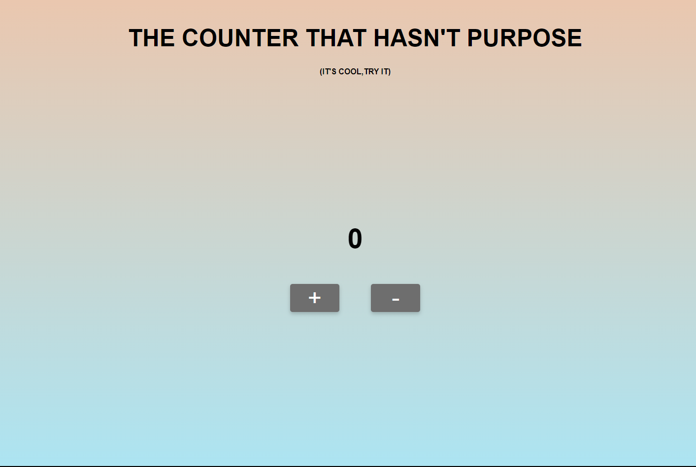

 

  <h2 align="center">Counter-JS</h2>

  

     
    <a href="https://github.com/gabrielecruciani/counter-js">Explore the docs »</a>
     
     
    <a href="https://counterjs-s2i.netlify.app">View Demo</a>
  

<!-- ABOUT THE PROJECT -->
## About The Project

  

 

This website is a project realized for Start2Impact University.

We needed to create a site that had two buttons "<strong>+</strong>" & "<strong>-</strong>" and that and that by clicking these two buttons it increased and decreased the value of the counter.
[Explore the docs](https://github.com/gabrielecruciani/counter-js)

### Built With

The application had to be developed with JavaScript. It wasn't allowed to use Jquery and any framework (React, Angular, Vue...).
 

<!-- LICENSE -->
## License

Distributed under the GENERAL PUBLIC LICENSE. See `LICENSE` for more information.
 

<!-- CONTACT -->
## Socials

